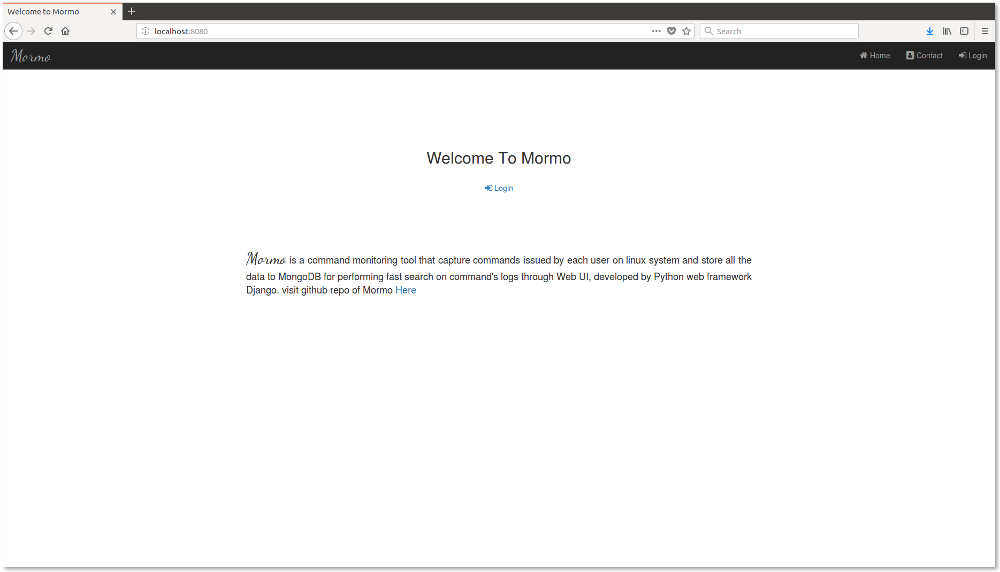
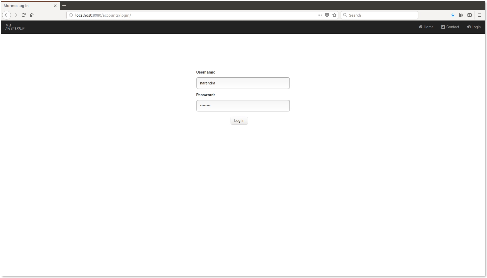
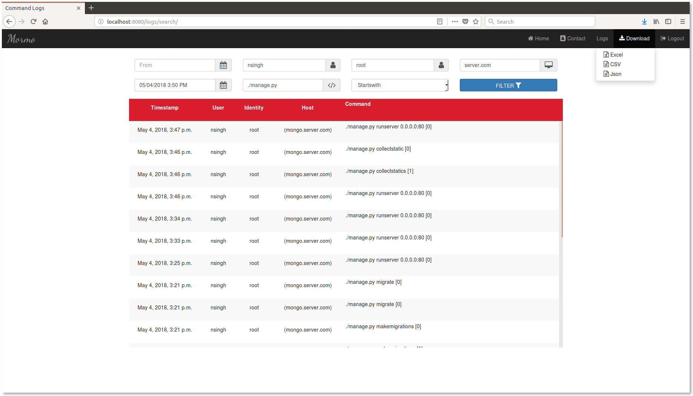

# mormo

Mormo is a command monitoring tool that capture commands issued by each user on linux system and store all the data to
MongoDB for performing fast search on command's logs through Web UI, developed by Python web framework Django.

